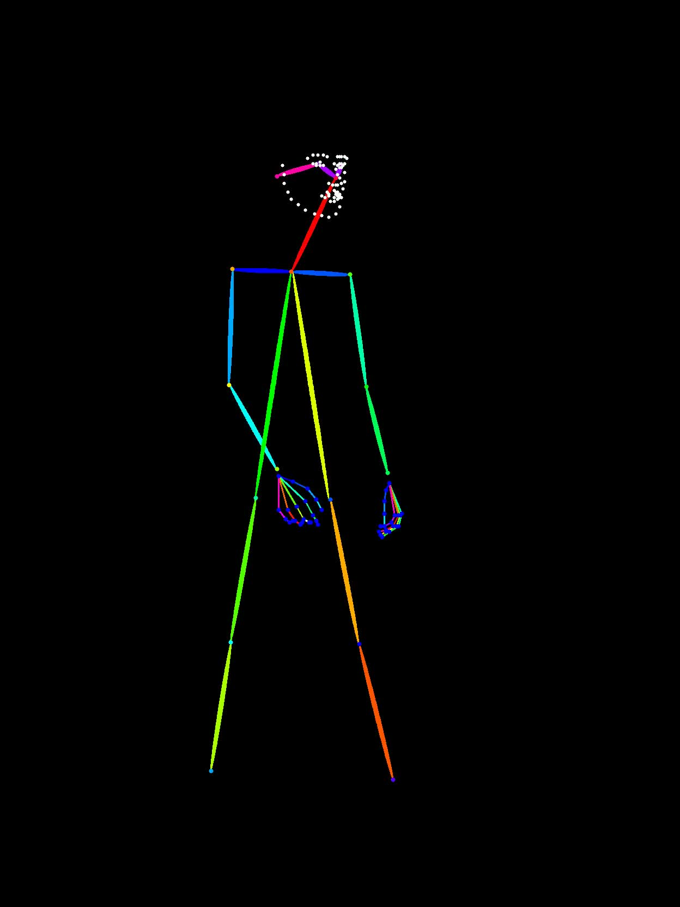
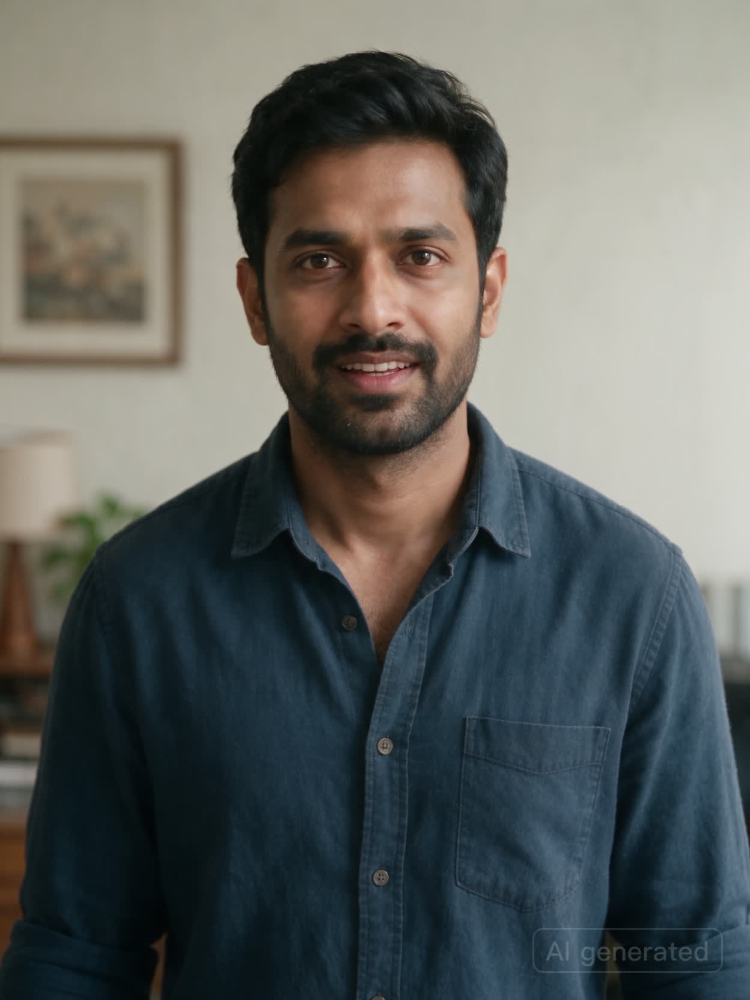
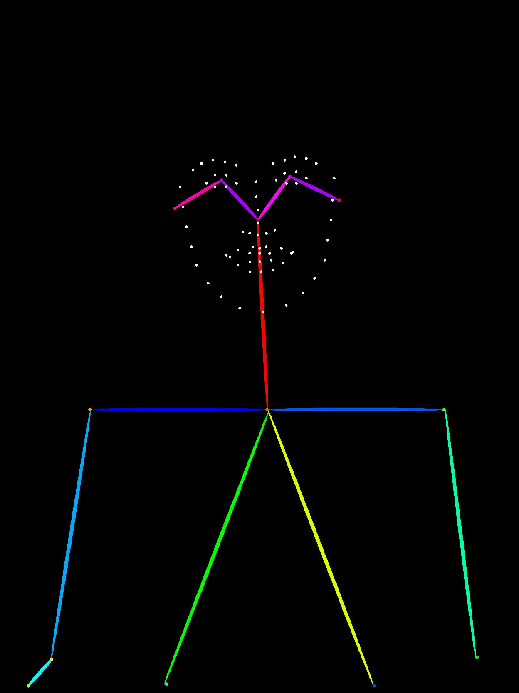
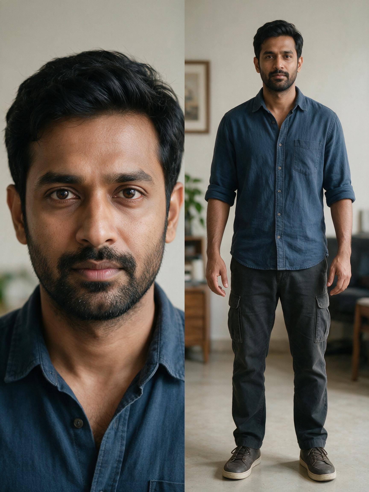

# Actor Motion Studio 


## Problem statement

LoRA fine-tuning bakes a subject's appearance and behavior into model
weights via per-subject training — high fidelity, but slow to produce and
expensive to maintain. Seedance's generations using multimodal references (`@Image1` for appearance, `@Video1`/`@Video2` for body/facial motion) is the training-free alternative: identity and motion are supplied as explicit references at generation time instead of learned. This repo builds and tests that alternative — no training involved anywhere in this pipeline.

## How it works

Three scripts, run via the shared `.venv`, turn footage into a Seedance
generation call:

- **`pose_drive.py`** — extracts an RTMPose whole-body skeleton from a
  performance clip and renders it as a skeleton-drive video.
- **`asset_runtime.py`** — uploads a character sheet to the asset library.
- **`seedance_runtime.py`** — Generates a Seedance video from the references.

Because motion is driven explicitly frame-by-frame, the skeleton reference
carries mannerism (timing, cadence, gait) directly rather than relying on a
model to infer it — the main fidelity gap against LoRA is on the appearance
side, since identity is anchored to a single `@Image1` still rather than a
learned multi-view model of the subject.

## Pipeline in action

A run through the pipeline end to end, using the sample clips under
[`docs/media/pipeline-demo/`](docs/media/pipeline-demo/).

**1. This body reference is converted to a skeleton reference** — becomes `@Video1`.

<table>
<tr><th>Body reference (source)</th><th>Skeleton reference (drive)</th></tr>
<tr>
<td></td>
<td></td>
</tr>
</table>

Full clips: [`body-reference.mp4`](docs/media/pipeline-demo/body-reference.mp4) →
[`body-reference-skeleton.mp4`](docs/media/pipeline-demo/body-reference-skeleton.mp4)

**2. This face reference is converted to a skeleton reference** — becomes `@Video2`.

<table>
<tr><th>Face reference (source)</th><th>Skeleton reference (drive)</th></tr>
<tr>
<td></td>
<td></td>
</tr>
</table>

Full clips: [`facial-reference.mp4`](docs/media/pipeline-demo/facial-reference.mp4) →
[`facial-reference-skeleton.mp4`](docs/media/pipeline-demo/facial-reference-skeleton.mp4)

**3. The character sheet is uploaded to the asset library** — becomes `@Image1`.



**4. These references are passed to create a video using Seedance 2.5.**

```bash
.venv/bin/python server/seedance_runtime.py create \
  --model "$SEEDANCE_MODEL" \
  --prompt "<scene description>" \
  --image-asset-uri "<@Image1 asset URL — character sheet>" \
  --body-reference-video-url "<@Video1 asset URL — body skeleton>" \
  --facial-reference-video-url "<@Video2 asset URL — facial skeleton>"
```

The backend creates the Seedance task and polls it through the Ark runtime
API until the generated video is ready.

## Repository layout

```text
dwpose/
├── apps/
│   └── actor-studio/       React (Vite) client + Express API — the application.
├── docs/
│   └── media/pipeline-demo/ Sample clips/stills used in "Pipeline in action" above.
├── .venv/                   Shared Python 3.9 environment used by every server-spawned
│                             script (pose_drive.py, seedance_runtime.py, asset_runtime.py).
├── requirements.txt         Pinned dependencies for .venv (pip freeze).
└── .claude/skills/          Project skill for Claude Code covering setup/run/troubleshoot.
```

`.venv` is the one thing shared across the workspace: `apps/actor-studio/server`
locates it via a relative path computed from the workspace root at startup —
see `WORKSPACE_ROOT` in
[`apps/actor-studio/server/index.js`](apps/actor-studio/server/index.js). Keep
`.venv` a sibling of `apps/` at the repository root, or update that constant.

## Prerequisites

- Node.js 18+ and npm
- Python 3.9
- A BytePlus credentials 

## Setup

```bash
python3 -m venv .venv
.venv/bin/pip install -r requirements.txt

npm install --prefix apps/actor-studio
npm install --prefix apps/actor-studio/client
npm install --prefix apps/actor-studio/server

cp apps/actor-studio/.env.example apps/actor-studio/.env
```

Fill in `apps/actor-studio/.env` with the keys you need — nothing is required just
to run the app and generate skeleton videos locally. See
[Configuration](#configuration) below for what each key controls.

## Running

```bash
npm run dev --prefix apps/actor-studio
```

Starts the API on `http://localhost:8787` and the UI on `http://localhost:5173`.
Or start each side independently:

```bash
npm run dev --prefix apps/actor-studio/server   # Express API on :8787
npm run dev --prefix apps/actor-studio/client   # Vite dev server on :5173
```

| Service | URL |
| --- | --- |
| UI | `http://localhost:5173` |
| API | `http://localhost:8787` |

## Configuration

All configuration lives in `apps/actor-studio/.env` (copy from `.env.example`).
Nothing is required to run the app and generate skeleton videos locally — the
sections below are additive, feature-gated capabilities.

| Variable | Required for | Notes |
| --- | --- | --- |
| `PORT` | — | API port, defaults to `8787` |
| `BYTEPLUS_AK` / `BYTEPLUS_SK` | Asset sync | BytePlus access credentials |
| `BYTEPLUS_REGION` | Asset sync | Defaults to `ap-southeast-1` |
| `TOS_REGION` / `TOS_BUCKET_NAME` / `TOS_ENDPOINT` | Asset sync | Object storage target for uploaded assets |
| `TOS_PREFIX` | Asset sync | Key prefix for uploaded objects, defaults to `ark-assets` |
| `TOS_PUBLIC_URL_PREFIX` | Asset sync, Seedance | Public URL prefix used to build shareable object URLs |
| `PUBLIC_BASE_URL` | Asset sync, Seedance | Public base URL of this deployment |
| `ARK_PROJECT` | Asset sync | Ark project name, defaults to `default` |
| `ARK_API_KEY` | Asset sync, Seedance | Ark API credential |
| `ARK_BASE_URL` | Seedance | Ark API base URL |
| `SEEDANCE_MODEL` | Seedance | Model identifier used for generation requests |

## Project data layout

Each project is created under `apps/actor-studio/projects/<project-slug>/`:

```text
Motion references/
├── body/                  uploaded body-motion source videos
├── facial/                 uploaded facial-motion source videos
└── processed/              generated *-skeleton.mp4 and *-overlay.mp4 outputs
    ├── body/
    └── facial/
character sheets/           uploaded stills, PDFs, or art references
seedance references/
├── reference images/
├── reference videos/
└── reference audios/
.actor-studio.json           project metadata: synced asset IDs, Seedance job history
```

This directory holds real user-uploaded content — it's gitignored, and the
app's own file-management routes are the intended way to modify it.

## Character sheet asset sync

Uploading an image into `character sheets` triggers, via `server/asset_runtime.py`:

1. Creates an Ark asset group for the project if one doesn't already exist.
2. Uploads the image bytes to TOS.
3. Builds a public object URL from `TOS_PUBLIC_URL_PREFIX`.
4. Calls `CreateAsset` to register that TOS object in the asset library.

Generated motion-reference `.mp4` outputs go through the same TOS upload step,
and their public URLs are stored in the project's `.actor-studio.json` for use
as Seedance references.

## Seedance 2.5 generation

Via `server/seedance_runtime.py`:

1. Select one synced character sheet asset as `@Image1`.
2. Select one generated motion-reference video as `@Video1` (optionally a
   second as `@Video2` for facial motion).
3. Edit the prompt template and start generation.
4. The backend creates a Seedance task and polls it through the Ark runtime API.

## Working with this repo in Claude Code

The `.claude/skills/celebrity-mannerism` skill drives the same three scripts
(`pose_drive.py`, `asset_runtime.py`, `seedance_runtime.py`) directly from the
command line — no app/server needed — so Claude Code picks it up automatically
for motion-transfer and Seedance-generation requests in this workspace.
